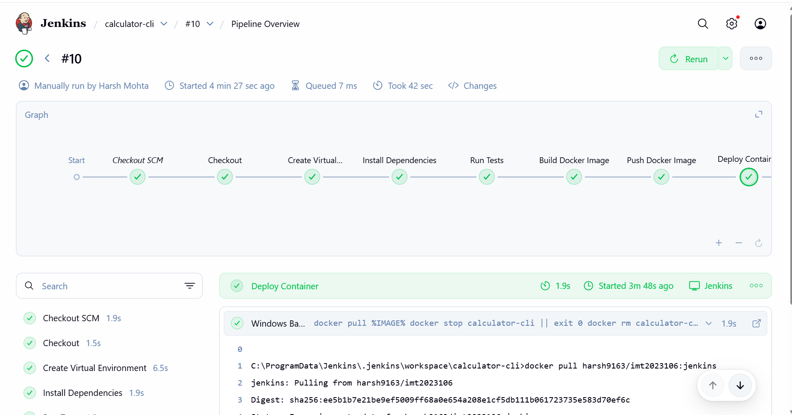
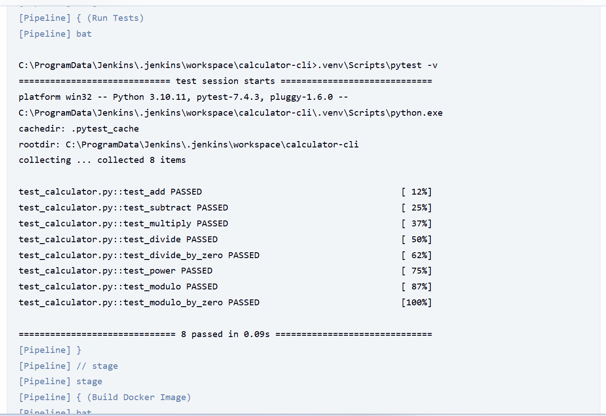
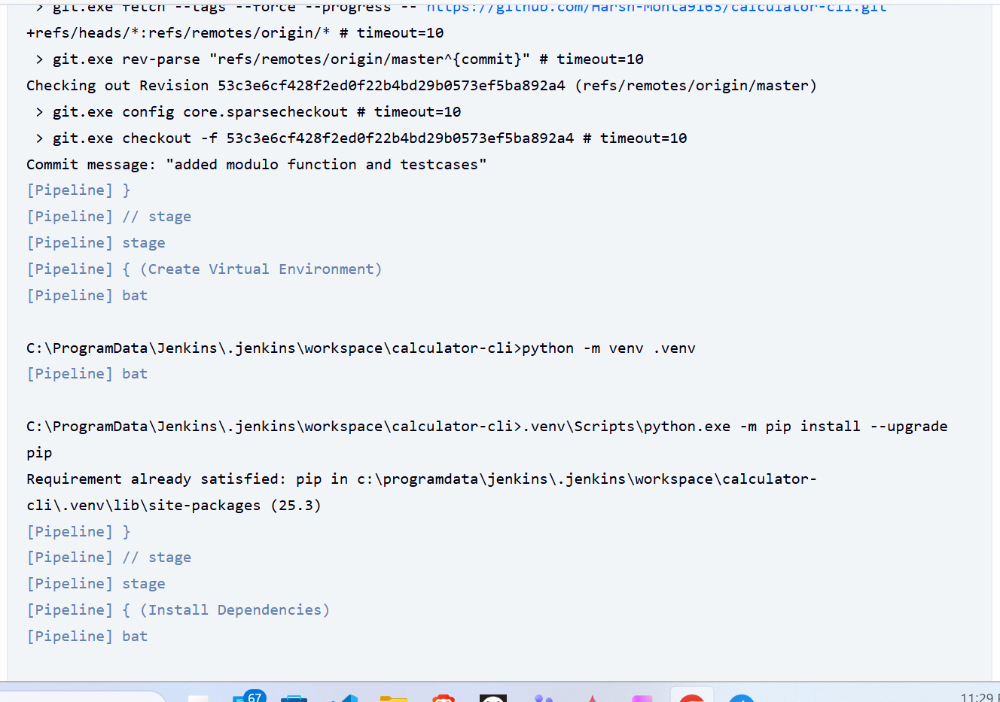

# Simple Calculator CLI Application

A simple command-line calculator application with CI/CD pipeline using Jenkins.

## Features

- Basic arithmetic operations: add, subtract, multiply, divide, power, modulo
- Interactive CLI interface
- Comprehensive unit tests with pytest
- Docker containerization
- Jenkins CI/CD pipeline

## Docker Hub

The Docker image is available on Docker Hub:
- **Repository**: [harsh9163/imt2023106](https://hub.docker.com/r/harsh9163/imt2023106)
- **Tag**: `jenkins`

### Pull and Run from Docker Hub

```bash
# Pull the image
docker pull harsh9163/imt2023106:jenkins

# Run the container
docker run -it harsh9163/imt2023106:jenkins
```

## Local Setup

### Prerequisites

- Python 3.10+
- Docker (optional)
- Jenkins (for CI/CD)

### Installation

1. Clone the repository:
```bash
git clone https://github.com/your-username/calculator-cli.git
cd calculator-cli
```

2. Create a virtual environment:
```bash
python -m venv .venv
.venv\Scripts\activate  # Windows
source .venv/bin/activate  # Linux/Mac
```

3. Install dependencies:
```bash
pip install -r requirements.txt
```

## Usage

### Run the Calculator

```bash
python calculator.py
```

### Run Tests

```bash
pytest -v
```

## Docker

### Build the Image

```bash
docker build -t calculator-cli .
```

### Run the Container

```bash
docker run -it calculator-cli
```

## Jenkins Pipeline

The Jenkinsfile includes the following stages:

1. **Checkout** - Clones the repository
2. **Create Virtual Environment** - Sets up Python virtual environment
3. **Install Dependencies** - Installs required packages
4. **Run Tests** - Executes pytest test suite
5. **Build Docker Image** - Creates Docker image
6. **Push Docker Image** - Pushes to Docker Hub
7. **Deploy Container** - Runs the application in a container

### Jenkins Pipeline Results

#### Pipeline Overview


#### Console Output Screenshots



<details>
<summary>Click to expand full console output</summary>

```
Started by user Harsh Mohta

Obtained Jenkinsfile from git https://github.com/Harsh-Mohta9163/calculator-cli.git
[Pipeline] Start of Pipeline
[Pipeline] node
Running on Jenkins
 in C:\ProgramData\Jenkins\.jenkins\workspace\calculator-cli
[Pipeline] {
[Pipeline] stage
[Pipeline] { (Declarative: Checkout SCM)
[Pipeline] checkout
Selected Git installation does not exist. Using Default
The recommended git tool is: NONE
using credential github-creds
 > git.exe rev-parse --resolve-git-dir C:\ProgramData\Jenkins\.jenkins\workspace\calculator-cli\.git # timeout=10
Fetching changes from the remote Git repository
 > git.exe config remote.origin.url https://github.com/Harsh-Mohta9163/calculator-cli.git # timeout=10
Fetching upstream changes from https://github.com/Harsh-Mohta9163/calculator-cli.git
 > git.exe --version # timeout=10
 > git --version # 'git version 2.44.0.windows.1'
using GIT_ASKPASS to set credentials 
 > git.exe fetch --tags --force --progress -- https://github.com/Harsh-Mohta9163/calculator-cli.git +refs/heads/*:refs/remotes/origin/* # timeout=10
 > git.exe rev-parse "refs/remotes/origin/master^{commit}" # timeout=10
Checking out Revision 53c3e6cf428f2ed0f22b4bd29b0573ef5ba892a4 (refs/remotes/origin/master)
 > git.exe config core.sparsecheckout # timeout=10
 > git.exe checkout -f 53c3e6cf428f2ed0f22b4bd29b0573ef5ba892a4 # timeout=10
Commit message: "added modulo function and testcases"
 > git.exe rev-list --no-walk 3ad22ca678bfb77664b0afa907113cc88cc72568 # timeout=10
[Pipeline] }
[Pipeline] // stage
[Pipeline] withEnv
[Pipeline] {
[Pipeline] withEnv
[Pipeline] {
[Pipeline] stage
[Pipeline] { (Checkout)
[Pipeline] checkout
Selected Git installation does not exist. Using Default
The recommended git tool is: NONE
using credential github-creds
 > git.exe rev-parse --resolve-git-dir C:\ProgramData\Jenkins\.jenkins\workspace\calculator-cli\.git # timeout=10
Fetching changes from the remote Git repository
 > git.exe config remote.origin.url https://github.com/Harsh-Mohta9163/calculator-cli.git # timeout=10
Fetching upstream changes from https://github.com/Harsh-Mohta9163/calculator-cli.git
 > git.exe --version # timeout=10
 > git --version # 'git version 2.44.0.windows.1'
using GIT_ASKPASS to set credentials 
 > git.exe fetch --tags --force --progress -- https://github.com/Harsh-Mohta9163/calculator-cli.git +refs/heads/*:refs/remotes/origin/* # timeout=10
 > git.exe rev-parse "refs/remotes/origin/master^{commit}" # timeout=10
Checking out Revision 53c3e6cf428f2ed0f22b4bd29b0573ef5ba892a4 (refs/remotes/origin/master)
 > git.exe config core.sparsecheckout # timeout=10
 > git.exe checkout -f 53c3e6cf428f2ed0f22b4bd29b0573ef5ba892a4 # timeout=10
Commit message: "added modulo function and testcases"
[Pipeline] }
[Pipeline] // stage
[Pipeline] stage
[Pipeline] { (Create Virtual Environment)
[Pipeline] bat

C:\ProgramData\Jenkins\.jenkins\workspace\calculator-cli>python -m venv .venv 

[Pipeline] bat

C:\ProgramData\Jenkins\.jenkins\workspace\calculator-cli>.venv\Scripts\python.exe -m pip install --upgrade pip 

Requirement already satisfied: pip in c:\programdata\jenkins\.jenkins\workspace\calculator-cli\.venv\lib\site-packages (25.3)
[Pipeline] }

[Pipeline] // stage
[Pipeline] stage
[Pipeline] { (Install Dependencies)
[Pipeline] bat

C:\ProgramData\Jenkins\.jenkins\workspace\calculator-cli>.venv\Scripts\pip install -r requirements.txt 

Requirement already satisfied: pytest==7.4.3 in c:\programdata\jenkins\.jenkins\workspace\calculator-cli\.venv\lib\site-packages (from -r requirements.txt (line 1)) (7.4.3)
Requirement already satisfied: iniconfig in c:\programdata\jenkins\.jenkins\workspace\calculator-cli\.venv\lib\site-packages (from pytest==7.4.3->-r requirements.txt (line 1)) (2.3.0)
Requirement already satisfied: packaging in c:\programdata\jenkins\.jenkins\workspace\calculator-cli\.venv\lib\site-packages (from pytest==7.4.3->-r requirements.txt (line 1)) (25.0)
Requirement already satisfied: pluggy<2.0,>=0.12 in c:\programdata\jenkins\.jenkins\workspace\calculator-cli\.venv\lib\site-packages (from pytest==7.4.3->-r requirements.txt (line 1)) (1.6.0)
Requirement already satisfied: exceptiongroup>=1.0.0rc8 in c:\programdata\jenkins\.jenkins\workspace\calculator-cli\.venv\lib\site-packages (from pytest==7.4.3->-r requirements.txt (line 1)) (1.3.1)
Requirement already satisfied: tomli>=1.0.0 in c:\programdata\jenkins\.jenkins\workspace\calculator-cli\.venv\lib\site-packages (from pytest==7.4.3->-r requirements.txt (line 1)) (2.3.0)
Requirement already satisfied: colorama in c:\programdata\jenkins\.jenkins\workspace\calculator-cli\.venv\lib\site-packages (from pytest==7.4.3->-r requirements.txt (line 1)) (0.4.6)
Requirement already satisfied: typing-extensions>=4.6.0 in c:\programdata\jenkins\.jenkins\workspace\calculator-cli\.venv\lib\site-packages (from exceptiongroup>=1.0.0rc8->pytest==7.4.3->-r requirements.txt (line 1)) (4.15.0)

[Pipeline] }
[Pipeline] // stage
[Pipeline] stage
[Pipeline] { (Run Tests)
[Pipeline] bat

C:\ProgramData\Jenkins\.jenkins\workspace\calculator-cli>.venv\Scripts\pytest -v 

============================= test session starts =============================
platform win32 -- Python 3.10.11, pytest-7.4.3, pluggy-1.6.0 -- C:\ProgramData\Jenkins\.jenkins\workspace\calculator-cli\.venv\Scripts\python.exe
cachedir: .pytest_cache
rootdir: C:\ProgramData\Jenkins\.jenkins\workspace\calculator-cli
collecting ... collected 8 items

test_calculator.py::test_add PASSED                                      [ 12%]
test_calculator.py::test_subtract PASSED                                 [ 25%]
test_calculator.py::test_multiply PASSED                                 [ 37%]
test_calculator.py::test_divide PASSED                                   [ 50%]
test_calculator.py::test_divide_by_zero PASSED                           [ 62%]
test_calculator.py::test_power PASSED                                    [ 75%]
test_calculator.py::test_modulo PASSED                                   [ 87%]
test_calculator.py::test_modulo_by_zero PASSED                           [100%]

============================== 8 passed in 0.09s ==============================
[Pipeline] }
[Pipeline] // stage
[Pipeline] stage
[Pipeline] { (Build Docker Image)
[Pipeline] bat


C:\ProgramData\Jenkins\.jenkins\workspace\calculator-cli>docker build -t harsh9163/imt2023106:jenkins . 

#0 building with "default" instance using docker driver

#1 [internal] load build definition from Dockerfile
#1 transferring dockerfile: 189B 0.0s done
#1 DONE 0.0s

#2 [auth] library/python:pull token for registry-1.docker.io
#2 DONE 0.0s

#3 [internal] load metadata for docker.io/library/python:3.10-slim

#3 DONE 1.9s


#4 [internal] load .dockerignore
#4 transferring context: 2B done
#4 DONE 0.0s

#5 [1/5] FROM docker.io/library/python:3.10-slim@sha256:c299e10e0070171113f9a1f109dd05e7e634fa94589b056e0e87bb22b2b382a2
#5 resolve docker.io/library/python:3.10-slim@sha256:c299e10e0070171113f9a1f109dd05e7e634fa94589b056e0e87bb22b2b382a2 0.1s done
#5 DONE 0.1s

#6 [internal] load build context
#6 transferring context: 746.33kB 0.4s done
#6 DONE 0.4s

#7 [2/5] WORKDIR /app
#7 CACHED

#8 [3/5] COPY requirements.txt .
#8 CACHED

#9 [4/5] RUN pip install -r requirements.txt
#9 CACHED

#10 [5/5] COPY . .

#10 DONE 0.9s

#11 exporting to image
#11 exporting layers

#11 exporting layers 1.0s done
#11 exporting manifest sha256:4681f3c6f1339154083872e81865178cb8e4a19d9d51a175c253be8a9d06244d 0.0s done
#11 exporting config sha256:453798f8e10a0456e8d9dad0c0f1101a579b11734d83a2bbef4f20159ca07903 0.0s done
#11 exporting attestation manifest sha256:4beed0180bd22c863acfc1b02572f6eafa1468062d047662dc1a0fda23fb8290 0.0s done
#11 exporting manifest list sha256:ee5b1b7e21be9ef5009ff68a0e654a208e1cf5db111b061723735e583d70ef6c 0.0s done
#11 naming to docker.io/harsh9163/imt2023106:jenkins done
#11 unpacking to docker.io/harsh9163/imt2023106:jenkins
#11 unpacking to docker.io/harsh9163/imt2023106:jenkins 0.5s done
#11 DONE 1.7s

[Pipeline] }
[Pipeline] // stage
[Pipeline] stage
[Pipeline] { (Push Docker Image)
[Pipeline] withCredentials
Masking supported pattern matches of %PASS%
[Pipeline] {
[Pipeline] bat

C:\ProgramData\Jenkins\.jenkins\workspace\calculator-cli>echo ****   | docker login -u harsh9163 --password-stdin 

Login Succeeded

C:\ProgramData\Jenkins\.jenkins\workspace\calculator-cli>docker push harsh9163/imt2023106:jenkins 
The push refers to repository [docker.io/harsh9163/imt2023106]
e36a2553786a: Waiting
f86ba98c4d0f: Waiting
396c201c8d3c: Waiting
918f588c588e: Waiting
0e4bc2bd6656: Waiting
9793cbb1e51a: Waiting
683c3659b1e9: Waiting

92c317df3fbf: Waiting
cd8d354256de: Waiting
92c317df3fbf: Waiting
cd8d354256de: Waiting
0e4bc2bd6656: Waiting
9793cbb1e51a: Waiting
683c3659b1e9: Waiting
918f588c588e: Waiting
e36a2553786a: Waiting
f86ba98c4d0f: Waiting
396c201c8d3c: Waiting
e36a2553786a: Waiting
f86ba98c4d0f: Waiting
396c201c8d3c: Waiting
918f588c588e: Waiting
0e4bc2bd6656: Waiting
9793cbb1e51a: Waiting
683c3659b1e9: Waiting
92c317df3fbf: Waiting
cd8d354256de: Waiting
e36a2553786a: Waiting
f86ba98c4d0f: Waiting
396c201c8d3c: Waiting
918f588c588e: Waiting
cd8d354256de: Waiting
0e4bc2bd6656: Waiting
9793cbb1e51a: Waiting
683c3659b1e9: Waiting
92c317df3fbf: Waiting
0e4bc2bd6656: Waiting
9793cbb1e51a: Waiting
683c3659b1e9: Waiting
92c317df3fbf: Waiting
cd8d354256de: Waiting
e36a2553786a: Waiting
f86ba98c4d0f: Waiting
396c201c8d3c: Waiting
918f588c588e: Waiting
e36a2553786a: Waiting
f86ba98c4d0f: Waiting
396c201c8d3c: Waiting
918f588c588e: Waiting
0e4bc2bd6656: Waiting
9793cbb1e51a: Waiting
683c3659b1e9: Waiting
92c317df3fbf: Waiting
cd8d354256de: Waiting
e36a2553786a: Waiting
f86ba98c4d0f: Waiting
396c201c8d3c: Waiting
918f588c588e: Waiting
0e4bc2bd6656: Waiting
9793cbb1e51a: Waiting
683c3659b1e9: Waiting
92c317df3fbf: Waiting
cd8d354256de: Waiting
e36a2553786a: Waiting
f86ba98c4d0f: Waiting
396c201c8d3c: Waiting
918f588c588e: Waiting
0e4bc2bd6656: Waiting
9793cbb1e51a: Waiting
683c3659b1e9: Waiting
92c317df3fbf: Waiting
cd8d354256de: Waiting
e36a2553786a: Waiting
f86ba98c4d0f: Waiting
396c201c8d3c: Waiting
918f588c588e: Waiting
0e4bc2bd6656: Waiting
9793cbb1e51a: Waiting
683c3659b1e9: Waiting
92c317df3fbf: Waiting
cd8d354256de: Waiting
918f588c588e: Waiting
e36a2553786a: Waiting
f86ba98c4d0f: Waiting
396c201c8d3c: Waiting
92c317df3fbf: Waiting
cd8d354256de: Waiting
0e4bc2bd6656: Waiting
9793cbb1e51a: Waiting
683c3659b1e9: Waiting
cd8d354256de: Waiting
0e4bc2bd6656: Waiting
9793cbb1e51a: Waiting
683c3659b1e9: Waiting
92c317df3fbf: Waiting
e36a2553786a: Waiting
f86ba98c4d0f: Waiting
396c201c8d3c: Waiting
918f588c588e: Waiting

92c317df3fbf: Waiting
cd8d354256de: Waiting
0e4bc2bd6656: Waiting
9793cbb1e51a: Waiting
683c3659b1e9: Waiting
918f588c588e: Waiting
e36a2553786a: Waiting
f86ba98c4d0f: Waiting
396c201c8d3c: Waiting
e36a2553786a: Waiting
f86ba98c4d0f: Waiting
396c201c8d3c: Waiting
918f588c588e: Waiting
0e4bc2bd6656: Waiting
9793cbb1e51a: Waiting
683c3659b1e9: Waiting
92c317df3fbf: Waiting
cd8d354256de: Waiting
9793cbb1e51a: Waiting
683c3659b1e9: Waiting
92c317df3fbf: Waiting
cd8d354256de: Waiting
0e4bc2bd6656: Waiting
f86ba98c4d0f: Waiting
396c201c8d3c: Waiting
918f588c588e: Waiting
e36a2553786a: Waiting
0e4bc2bd6656: Waiting
9793cbb1e51a: Waiting
683c3659b1e9: Waiting
92c317df3fbf: Waiting
cd8d354256de: Waiting
e36a2553786a: Waiting
f86ba98c4d0f: Waiting
396c201c8d3c: Waiting
918f588c588e: Waiting
92c317df3fbf: Waiting
cd8d354256de: Waiting
0e4bc2bd6656: Waiting
9793cbb1e51a: Waiting
683c3659b1e9: Waiting
918f588c588e: Waiting
e36a2553786a: Waiting
f86ba98c4d0f: Waiting
396c201c8d3c: Waiting
e36a2553786a: Waiting
f86ba98c4d0f: Waiting
396c201c8d3c: Waiting
918f588c588e: Waiting
0e4bc2bd6656: Waiting
9793cbb1e51a: Waiting
683c3659b1e9: Waiting
92c317df3fbf: Waiting
cd8d354256de: Waiting
92c317df3fbf: Layer already exists
cd8d354256de: Waiting
0e4bc2bd6656: Layer already exists
9793cbb1e51a: Waiting
683c3659b1e9: Waiting
918f588c588e: Waiting
e36a2553786a: Waiting
f86ba98c4d0f: Waiting
396c201c8d3c: Waiting
9793cbb1e51a: Waiting
683c3659b1e9: Waiting
cd8d354256de: Waiting
e36a2553786a: Waiting
f86ba98c4d0f: Waiting
396c201c8d3c: Waiting
918f588c588e: Waiting
9793cbb1e51a: Waiting
683c3659b1e9: Waiting
cd8d354256de: Waiting
e36a2553786a: Waiting
f86ba98c4d0f: Waiting
396c201c8d3c: Waiting
918f588c588e: Waiting

9793cbb1e51a: Waiting
683c3659b1e9: Waiting
cd8d354256de: Waiting
e36a2553786a: Waiting
f86ba98c4d0f: Waiting
396c201c8d3c: Waiting
918f588c588e: Waiting
9793cbb1e51a: Waiting
683c3659b1e9: Waiting
cd8d354256de: Waiting
e36a2553786a: Waiting
f86ba98c4d0f: Waiting
396c201c8d3c: Waiting
918f588c588e: Waiting
396c201c8d3c: Layer already exists
918f588c588e: Waiting
e36a2553786a: Waiting
f86ba98c4d0f: Layer already exists
683c3659b1e9: Layer already exists
cd8d354256de: Layer already exists
9793cbb1e51a: Layer already exists

e36a2553786a: Pushed

918f588c588e: Pushed

jenkins: digest: sha256:ee5b1b7e21be9ef5009ff68a0e654a208e1cf5db111b061723735e583d70ef6c size: 856
[Pipeline] }
[Pipeline] // withCredentials
[Pipeline] }
[Pipeline] // stage
[Pipeline] stage
[Pipeline] { (Deploy Container)
[Pipeline] bat

C:\ProgramData\Jenkins\.jenkins\workspace\calculator-cli>docker pull harsh9163/imt2023106:jenkins 

jenkins: Pulling from harsh9163/imt2023106
Digest: sha256:ee5b1b7e21be9ef5009ff68a0e654a208e1cf5db111b061723735e583d70ef6c
Status: Image is up to date for harsh9163/imt2023106:jenkins
docker.io/harsh9163/imt2023106:jenkins

C:\ProgramData\Jenkins\.jenkins\workspace\calculator-cli>docker stop calculator-cli   || exit 0 
Error response from daemon: No such container: calculator-cli
[Pipeline] }
[Pipeline] // stage
[Pipeline] }
[Pipeline] // withEnv
[Pipeline] }
[Pipeline] // withEnv
[Pipeline] }
[Pipeline] // node
[Pipeline] End of Pipeline
Finished: SUCCESS
```

</details>


### Setup Jenkins

1. Update the `IMAGE` environment variable in Jenkinsfile with your Docker Hub username
2. Update the repository URL in the Checkout stage
3. Configure credentials in Jenkins:
   - `github-creds` for GitHub access
   - `dockerhub-creds` for Docker Hub
4. Create a new Pipeline job in Jenkins pointing to your repository

## Project Structure

```
calculator-cli/
├── calculator.py         # Main calculator application
├── test_calculator.py    # Unit tests
├── requirements.txt      # Python dependencies
├── Dockerfile           # Docker configuration
├── Jenkinsfile          # Jenkins pipeline configuration
└── README.md            # This file
```

## License

MIT License
